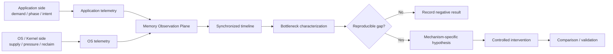
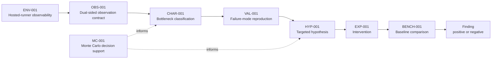

# Finite RAM Lab

A small, reproducible systems research lab for understanding how finite physical RAM aligns with actual application memory demand.

> **Core question:**  
> When physical RAM is limited, what should remain in memory, what should be reclaimed, and when?

[](https://github.com/hopeless-t/finite-ram-lab/actions/workflows/ci.yml)
[](https://github.com/hopeless-t/finite-ram-lab/actions/workflows/env-001.yml)
[](https://github.com/hopeless-t/finite-ram-lab/actions/workflows/env-002.yml)
[](https://github.com/hopeless-t/finite-ram-lab/actions/workflows/obs-001.yml)
[](https://github.com/hopeless-t/finite-ram-lab/actions/workflows/char-001.yml)
[](https://github.com/hopeless-t/finite-ram-lab/actions/workflows/monte-carlo.yml)

## Status

**Systems research / experimental software — Chapter II active**

Current principle:

> **Prove the state before interpreting the outcome.**

Finite RAM Lab has moved from broad finite-memory characterization into a narrower Linux memcg state-transition study.

### Chapter I — what was established

The current memcg lane has strong evidence for:

- a source-grounded 64-page memcg charge batch;
- a resettable Q64 stock phase;
- controlled PTE preconditioning that removes measured page-table growth from the target sequence;
- a shared per-CPU LRU release path that can contaminate `memory.current` without consuming the target residual stock;
- a direct charge-side observer that sees Q64 even when net `memory.current` is masked by a simultaneous release;
- historical controlled-spawn endpoint 49/72 and primer-qualified terminal pattern 55/55, both kept frozen under their original semantics.

The major semantic correction is that historical SUCCESS/FAIL was too coarse. A first-touch miss, an observer contamination event, an invalidated stock epoch, and a genuine target contradiction are not the same thing.

### Chapter II — current frontier

The active model is transactional:

```text
predict
  -> normalize
  -> verify direct Q64
  -> execute
  -> target
  -> commit
```

Known state invalidators include:

- unexpected refill;
- relevant stock-CPU memcg stock drain;
- PTE growth;
- CPU mismatch;
- worker error;
- incomplete trace.

A positively source-grounded LRU release is treated as observation contamination rather than residual-stock consumption.

After a verified direct Q64 primer, the clean model begins with residual stock:

```text
R0 = 63
```

and predicts the next direct-Q64 boundary at post-primer touch:

```text
T0 = 64
```

The Chapter-II rare specimen is therefore:

```text
UNEXPLAINED_BOUNDARY_DEVIATION
```

meaning a complete verified epoch with no known invalidator and an observed boundary `T != 64`.

### Current experiment sequence

The physical program is intentionally staged:

1. **B404 transactional smoke — COMPLETE / PASS** — R2 produced 12/12 normal SUCCESS, zero TARGET_FAIL, zero instrumentation holds, and a passing forced invalidation/re-prime sentinel;
2. **B405 perturbation matrix — NEXT** — CLEAN / RELEASE_ONLY / UNEXPECTED_REFILL / PTE_GROWTH causal controls;
3. **TX-AGE-DECOUPLING Stage A** — FAST x4 + HOLD32 x12, selected by Monte Carlo to discriminate touch-driven from wall-clock-driven hidden transitions;
4. **adaptive Stage B only if triggered** — HOLD8 / HOLD32 / HOLD56 x4 each to turn a captured event into a position-dependent `Delta = T - 64` fingerprint;
5. passive hazard mapping and reliability certification only after the mechanism boundary is understood.

B404's passing run is protocol evidence, not a population-level 100% reliability claim.

The repository now carries epoch-local owner identity, receipt packet v2, touch-age / wall-clock-age telemetry, hard re-prime isolation, stale-epoch rejection, and source-grounded release classification.

See:

- [B404 R2 — Transactional physical smoke PASS](docs/B404-R2-TRANSACTIONAL-SPAWN-PHYSICAL-PASS.md)
- [B404 R1 — Observer falsification result](docs/B404-R1-TRANSACTIONAL-SPAWN-PHYSICAL-RESULT.md)
- [MATH-022 — Boundary invariant and rare-transition capture](docs/MATH-022-BOUNDARY-INVARIANT-RARE-TRANSITION-CAPTURE.md)
- [MATH-023 — Monte Carlo age-decoupling design](docs/MATH-023-AGE-DECOUPLING-DESIGN-MONTE-CARLO.md)
- [OBS-007 — Epoch-local transaction observer](docs/OBS-007-EPOCH-LOCAL-TRANSACTION-OBSERVER.md)
- [Current handoff](handoffs/CURRENT.md)

Historical project stages and negative results remain part of the evidence record; this README now tracks the active frontier rather than repeating the full experiment ledger.

## Why this project exists

Applications and operating systems observe different parts of the memory problem.

Applications can know the meaning, lifecycle, rebuild cost, phase, and near-future importance of their own data.

The operating system can observe global physical-memory pressure, competition between processes, residency, reclaim activity, faults, refaults, swap behavior, and system-wide resource constraints.

Finite RAM Lab asks whether a measurable gap exists between:

```text
actual application demand
          ↕
OS-estimated demand
          ↕
physical-memory residency
```

and whether closing any observed gap can move the practical memory limit without unacceptable performance loss.

The project does **not** assume that existing Linux memory management is inefficient.

## Research architecture



Observation is intentionally separated from intervention.

## Research order

```text
Observe
  ↓
Characterize
  ↓
Reproduce
  ↓
Form hypothesis
  ↓
Intervene
  ↓
Compare
```

A future mechanism may be an application hint library, a userspace coordination agent, a hybrid design, a minimal kernel extension, or no new mechanism at all.

The implementation is an experimental result, not a premise.

## AI Worker calculation toolbox

The repository includes a spec-driven calculation interface so an AI worker does not need to re-derive standard analysis code for every experiment.

```bash
pip install -e ".[analysis]"
frl doctor
frl catalog
frl template changepoint
frl run-spec path/to/spec.json --out evidence/result.json
```

Ready-made tools currently cover:

- changepoint / knee detection;
- exact offline residency optimization with SciPy/HiGHS MILP;
- conditional information gain;
- small ARX system identification;
- generalized Pareto tail fitting;
- Sobol / Latin-hypercube experiment design;
- PRCC parameter screening.

The same interface can run on GitHub-hosted Actions through `.github/workflows/research-calc.yml`.

See [AI Worker Calculation Toolbox](docs/AI_WORKER_TOOLBOX.md).

## Evidence rules

- observation is not explanation;
- correlation is not causation;
- a refault is not automatically a bad eviction;
- high memory utilization is not automatically inefficient;
- free memory is not itself an optimization objective;
- a successful program execution is not automatically a successful experiment;
- a benchmark improvement is not sufficient evidence of a general memory-management improvement;
- GitHub-hosted measurements describe the declared hosted environment, not arbitrary bare-metal PCs.

Canonical evidence must be structured and carry provenance.

Plots and rendered diagrams are explanatory artifacts unless an experiment contract explicitly says otherwise.

## Research roadmap



Later nodes describe research stages, not predetermined mechanisms.

## Repository structure

```text
finite-ram-lab/
├── README.md
├── pyproject.toml
├── specs/
│   ├── ENV-001.json
│   ├── ENV-002.json
│   ├── OBS-001.json
│   ├── CHAR-001.json
│   ├── MC-001.json
│   └── MC-QUALITY-001.json
├── src/finite_ram_lab/
│   ├── env_probe.py
│   ├── limit_probe.py
│   ├── obs_workload.py
│   ├── char_sweep.py
│   ├── calculators.py
│   ├── cli.py
│   ├── sim.py
│   ├── mc.py
│   └── aggregate_mc.py
├── tests/
├── docs/
│   ├── RESEARCH_CHARTER.md
│   ├── REPOSITORY_SPEC.md
│   ├── EVIDENCE_MODEL.md
│   ├── ENV-001.md
│   ├── ENV-002.md
│   ├── OBS-001.md
│   ├── CHAR-001.md
│   ├── AI_WORKER_TOOLBOX.md
│   ├── MONTE_CARLO.md
│   ├── EXECUTION_MODEL.md
│   └── NORTH_STAR.md
└── .github/workflows/
    ├── ci.yml
    ├── env-001.yml
    ├── env-002.yml
    ├── obs-001.yml
    ├── char-001.yml
    ├── research-calc.yml
    ├── deep-monte-carlo.yml
    └── monte-carlo.yml
```

The repository grows only when a real experiment or validation need earns a new component.

## Frozen principles

See:

- [Research Charter](docs/RESEARCH_CHARTER.md)
- [Repository Specification](docs/REPOSITORY_SPEC.md)
- [Evidence Model](docs/EVIDENCE_MODEL.md)
- [Execution Model](docs/EXECUTION_MODEL.md)
- [North Star](docs/NORTH_STAR.md)

## Project principle

> **Observe before optimizing.**

And, for future architecture:

> **Do not choose the control plane before measuring the coordination gap.**


## Inspired research

### STRATA-001 — page-cache bypass and semantic HOT-memory preservation

STRATA-001 was inspired by [Niko1221/Strata](https://github.com/Niko1221/Strata), whose explicit VRAM/RAM/SSD tiering and Linux direct-I/O path motivated a narrower Finite RAM Lab question: whether keeping intentionally COLD file data out of page-cache pressure can preserve intentionally HOT anonymous memory under a finite memory budget.

See [the Strata inspiration note](docs/STRATA-INSPIRATION.md) and [STRATA-001 Council](docs/STRATA-001-COUNCIL.md).

The initial study is an independent implementation; no Strata source code is copied into Finite RAM Lab.
