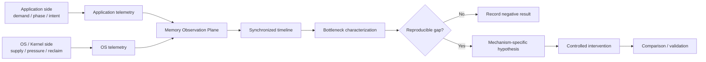
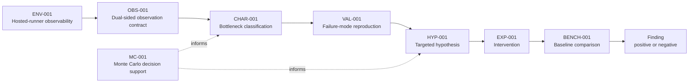

# Finite RAM Lab

A small, reproducible systems research lab for understanding how finite physical RAM aligns with actual application memory demand.

> **Core question:**  
> When physical RAM is limited, what should remain in memory, what should be reclaimed, and when?

[](https://github.com/hopeless-t/finite-ram-lab/actions/workflows/ci.yml)
[](https://github.com/hopeless-t/finite-ram-lab/actions/workflows/env-001.yml)
[](https://github.com/hopeless-t/finite-ram-lab/actions/workflows/env-002.yml)
[](https://github.com/hopeless-t/finite-ram-lab/actions/workflows/obs-001.yml)
[](https://github.com/hopeless-t/finite-ram-lab/actions/workflows/monte-carlo.yml)

## Status

**Systems research / experimental software — early development**

Current principle:

> **Observation before coordination.**

The project currently uses GitHub-hosted Linux runners as its primary experimental substrate. It begins by characterizing what can actually be observed there before making memory-management claims.

Current evidence:

- **ENV-001 — PASS:** hosted-runner memory telemetry is observable;
- **ENV-002 — PASS:** isolated cgroup memory budgets are enforceable;
- **OBS-001 — PASS:** application phases and OS memory state can be captured on one monotonic timeline;
- **MC-001 — 16,000 trials:** seeded synthetic replacement study completed successfully.

**Next research stage:** CHAR-001 — characterize which pressure transitions are causal, repeatable bottlenecks rather than coincident symptoms.

No new memory-management policy or coordination mechanism is authorized by the current evidence.

## Why this project exists

Applications and operating systems observe different parts of the memory problem.

Applications can know the meaning, lifecycle, rebuild cost, phase, and near-future importance of their own data.

The operating system can observe global physical-memory pressure, competition between processes, residency, reclaim activity, faults, refaults, swap behavior, and system-wide resource constraints.

Finite RAM Lab asks whether a measurable gap exists between:

```text
actual application demand
          ↕
OS-estimated demand
          ↕
physical-memory residency
```

and whether closing any observed gap can move the practical memory limit without unacceptable performance loss.

The project does **not** assume that existing Linux memory management is inefficient.

## Research architecture



Observation is intentionally separated from intervention.

## Research order

```text
Observe
  ↓
Characterize
  ↓
Reproduce
  ↓
Form hypothesis
  ↓
Intervene
  ↓
Compare
```

A future mechanism may be an application hint library, a userspace coordination agent, a hybrid design, a minimal kernel extension, or no new mechanism at all.

The implementation is an experimental result, not a premise.

## Evidence rules

- observation is not explanation;
- correlation is not causation;
- a refault is not automatically a bad eviction;
- high memory utilization is not automatically inefficient;
- free memory is not itself an optimization objective;
- a successful program execution is not automatically a successful experiment;
- a benchmark improvement is not sufficient evidence of a general memory-management improvement;
- GitHub-hosted measurements describe the declared hosted environment, not arbitrary bare-metal PCs.

Canonical evidence must be structured and carry provenance.

Plots and rendered diagrams are explanatory artifacts unless an experiment contract explicitly says otherwise.

## Research roadmap



Later nodes describe research stages, not predetermined mechanisms.

## Repository structure

```text
finite-ram-lab/
├── README.md
├── pyproject.toml
├── specs/
│   ├── ENV-001.json
│   ├── ENV-002.json
│   ├── OBS-001.json
│   └── MC-001.json
├── src/finite_ram_lab/
│   ├── env_probe.py
│   ├── limit_probe.py
│   ├── obs_workload.py
│   ├── sim.py
│   ├── mc.py
│   └── aggregate_mc.py
├── tests/
├── docs/
│   ├── RESEARCH_CHARTER.md
│   ├── REPOSITORY_SPEC.md
│   ├── EVIDENCE_MODEL.md
│   ├── ENV-001.md
│   ├── ENV-002.md
│   ├── OBS-001.md
│   ├── MONTE_CARLO.md
│   ├── EXECUTION_MODEL.md
│   └── NORTH_STAR.md
└── .github/workflows/
    ├── ci.yml
    ├── env-001.yml
    ├── env-002.yml
    ├── obs-001.yml
    └── monte-carlo.yml
```

The repository grows only when a real experiment or validation need earns a new component.

## Frozen principles

See:

- [Research Charter](docs/RESEARCH_CHARTER.md)
- [Repository Specification](docs/REPOSITORY_SPEC.md)
- [Evidence Model](docs/EVIDENCE_MODEL.md)
- [Execution Model](docs/EXECUTION_MODEL.md)
- [North Star](docs/NORTH_STAR.md)

## Project principle

> **Observe before optimizing.**

And, for future architecture:

> **Do not choose the control plane before measuring the coordination gap.**
