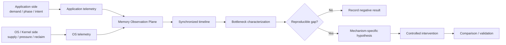
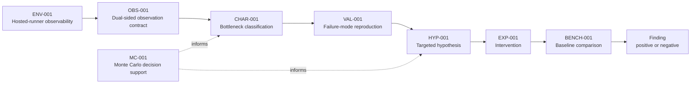

# Finite RAM Lab

A small, reproducible systems research lab for understanding how finite physical RAM aligns with actual application memory demand.

> **Core question:**  
> When physical RAM is limited, what should remain in memory, what should be reclaimed, and when?

[](https://github.com/hopeless-t/finite-ram-lab/actions/workflows/ci.yml)
[](https://github.com/hopeless-t/finite-ram-lab/actions/workflows/env-001.yml)
[](https://github.com/hopeless-t/finite-ram-lab/actions/workflows/env-002.yml)
[](https://github.com/hopeless-t/finite-ram-lab/actions/workflows/obs-001.yml)
[](https://github.com/hopeless-t/finite-ram-lab/actions/workflows/char-001.yml)
[](https://github.com/hopeless-t/finite-ram-lab/actions/workflows/monte-carlo.yml)

## Status

**Systems research / experimental software — Chapter II active + adaptive Governor application lane qualified through B501**

Current principle:

> **Prove the state before interpreting the outcome.**

Finite RAM Lab has moved from broad finite-memory characterization into a narrower Linux memcg state-transition study.

### Chapter I — what was established

The current memcg lane has strong evidence for:

- a source-grounded 64-page memcg charge batch;
- a resettable Q64 stock phase;
- controlled PTE preconditioning that removes measured page-table growth from the target sequence;
- a shared per-CPU LRU release path that can contaminate `memory.current` without consuming the target residual stock;
- a direct charge-side observer that sees Q64 even when net `memory.current` is masked by a simultaneous release;
- historical controlled-spawn endpoint 49/72 and primer-qualified terminal pattern 55/55, both kept frozen under their original semantics.

The major semantic correction is that historical SUCCESS/FAIL was too coarse. A first-touch miss, an observer contamination event, an invalidated stock epoch, and a genuine target contradiction are not the same thing.

### Chapter II — current frontier

The largest Chapter-II correction is methodological:

> **Historical SUCCESS/FAIL was too coarse. The research now asks which named state transition occurred before it asks whether the run "failed."**

The active state model distinguishes natural pre-VERIFY state from verified transactional state:

```text
natural pre-VERIFY ecology
  ├─ PREVERIFY_S64 / MAX_STOCK_BOUNDARY
  ├─ STARTUP_STOCK_SEED
  └─ SMALL_RESIDUAL_REFILL
          |
          v
       NORMALIZE
          |
     measured direct Q64
          |
          v
     VERIFIED R0 = 63
          |
          ├─ source-grounded RELEASE_ONLY
          ├─ TARGET_STOCK_EVICTION
          ├─ explicit invalidators
          └─ TARGET
                 |
            SUCCESS / true TARGET_FAIL
```

After a measured one-page direct-Q64 primer, the verified residual invariant remains:

```text
R0 = 63
T0 = 64
```

But natural pre-VERIFY stock is broader. Source and physical evidence support:

```text
0 <= S0 <= 64
T = S0 + 1
```

with the following named mechanisms/states:

- **PREVERIFY_S64 / MAX_STOCK_BOUNDARY** — the natural stock can legally begin at 64 before the experiment establishes its own primer;
- **STARTUP_STOCK_SEED** — transient service / worker startup can leave large inherited stock on the future stock CPU; a cpuset intervention strongly suppresses the large high-T phenotype;
- **SMALL_RESIDUAL_REFILL — ESTABLISHED** — two zero-miss physical specimens captured `systemd` PID 1 returning exactly one page to the later measured owner memcg on the future stock CPU, followed by `S0=1` and first measured Q64 at `T=2`;
- **TARGET_STOCK_EVICTION** — verified residual stock can be asynchronously drained, moving the next Q64 boundary earlier;
- **RELEASE_ONLY** — a positively source-grounded shared-LRU release can change accounting while preserving the target residual.

Known explicit invalidators still include unexpected refill, relevant stock-CPU drain, PTE growth, CPU mismatch, worker error, and incomplete observer coverage.

Across the completed B405 generations, no complete verified target path has produced a genuine `TARGET_FAIL`. That is a current evidence statement, not a reliability guarantee.

### Current experiment sequence

The physical program is now:

1. **B404 transactional smoke — COMPLETE / PASS** — 12/12 normal protocol successes plus a forced invalidation/re-prime sentinel;
2. **B405 causal matrix — mechanism decomposition complete enough to move the frontier** — CLEAN / RELEASE_ONLY / UNEXPECTED_REFILL / PTE_GROWTH plus observer-coverage work exposed named invalidators instead of an undifferentiated FAIL bucket;
3. **normalize ecology — COMPLETE for the major known states** — R9 confirmed the source-derived `T <= 65` bound in 32/32 identities, and the frozen R8 specimen established `PREVERIFY_S64`;
4. **STARTUP_STOCK_SEED — ESTABLISHED and causally challenged** — startup Q64/refill63 explains the large inherited-stock cluster, and `AllowedCPUs=prep` suppresses that large phenotype;
5. **SMALL_RESIDUAL_REFILL — ESTABLISHED** — R13-B1 captured two independent zero-miss `refill_stock(...,1) -> S0=1 -> T=2` specimens;
6. **current next step: refill1 provenance** — identify the exact caller path behind the systemd PID1 refill1 receipts;
7. **then return to age-decoupling** — use the already-frozen FAST/HOLD design to study verified-state wall-clock hazards rather than continuing to expand the pre-VERIFY taxonomy indefinitely.

The project deliberately separates mechanism existence, provenance, prevalence, and transactional reliability. Establishing one does not imply the others.

See:

- [OBS-011 — SMALL_RESIDUAL_REFILL established](docs/OBS-011-SMALL-RESIDUAL-REFILL-ESTABLISHED.md)
- [OBS-010 — R13-A refill1 candidate and scope correction](docs/OBS-010-R13A-SMALL-RESIDUAL-REFILL-RESULT.md)
- [MATH-024 — Pre-VERIFY stock bound and 65-touch theorem](docs/MATH-024-PREVERIFY-STOCK-BOUND-65-TOUCH-THEOREM.md)
- [B404 R2 — Transactional physical smoke PASS](docs/B404-R2-TRANSACTIONAL-SPAWN-PHYSICAL-PASS.md)
- [MATH-023 — Monte Carlo age-decoupling design](docs/MATH-023-AGE-DECOUPLING-DESIGN-MONTE-CARLO.md)
- [Current handoff](handoffs/CURRENT.md)

Historical project stages and negative results remain part of the evidence record; this README now tracks the active frontier rather than repeating the full experiment ledger.

## Adaptive Governor / application lane — B461 through B500

A second active lane now turns the lab's evidence model into an executable memory-policy application.

The key unifying principle is:

> **Information obligation is not the same thing as simultaneously resident representation.**

That line began with exact streamed reconstruction and physical peak measurement, then moved through mechanism biopsy, implementation repair, calibrated policy selection, runtime dogfood, online evidence update, a reusable GitHub Actions application surface, and finally a host-bound local qualifier.

The current evidence chain is:

```text
B461  obligation/residency separation
  ↓
B462  hosted physical peak proxy
  ↓
B483-B485  localize and confirm content-sensitive centering temporary
  ↓
B486  exact tiled centering repair
  ↓
B487  rebuild repaired q frontier
  ↓
B489  19-runner / 95%-class repaired calibration
  ↓
B490  repaired Governor v2
  ↓
B491-B493  runtime dogfood -> tail/drift diagnosis -> online update -> v2.1
  ↓
B494  stable CLI + GitHub Composite Action application surface
  ↓
B495  downstream consumer workflow drives real numerical execution
  ↓
B496-B500  local/LDC bootstrap, calibration, Pareto extension,
           host-bound promotion, and one-shot adaptive qualifier
  ↓
B501  bounded MVCA/LDC admission contract for first real local run
```

### Repaired hosted Governor v2.1

The hosted repaired runtime currently uses `TILED_WHERE`.

The evidence-qualified v2.1 policy points are:

| empirical peak budget | q | independent hosted-runner samples | rank-max floor |
|---:|---:|---:|---:|
| 50,696,192 B | 2 | 27 | 27/28 ≈ 96.43% |
| 58,941,440 B | 4 | 27 | 27/28 ≈ 96.43% |
| 71,512,064 B | 7 | 27 | 27/28 ≈ 96.43% |

These are **hosted-environment empirical calibration values**, not universal RAM limits.

The q7 boundary moved upward by one page after a tail-compatible runtime observation. The online updater accepted that observation only after the predeclared tail-vs-drift diagnostic found no drift suspect. Drift-suspect panels fail closed rather than silently widening the policy.

### GitHub Actions application surface

The qualified application contract is available through both a lightweight CLI and a Composite Action.

CLI:

```bash
frl governor-select \
  --policy policies/repaired-governor-v2.1.json \
  --peak-budget-bytes 60000000 \
  --minimum-rank-coverage 0.95 \
  --out governor-receipt.json
```

Composite Action:

```yaml
- uses: hopeless-t/finite-ram-lab/.github/actions/finite-ram-governor@<ref>
  id: governor
  with:
    peak-budget-bytes: "60000000"
    minimum-rank-coverage: "0.95"
    receipt-path: "governor-receipt.json"

- run: echo "selected q = ${{ steps.governor.outputs.selected-q }}"
```

The decision receipt exposes the selected q, empirical boundary, sample count, rank-coverage floor, policy version, implementation, provenance, and exchangeability assumption.

B495 proved the full consumer path:

```text
application RAM request
-> Governor Action
-> q output
-> downstream physical execution
-> exact semantic gate
-> observed peak
-> application execution receipt
```

with q2/q4/q7 consumer jobs all completing exactly and with no boundary exceedance in that panel.

### Local development-machine bridge

Hosted thresholds are **not copied onto a development machine**.

The local lane deliberately restarts with all four candidates:

`{q1, q2, q4, q7}`

because a dominance relation observed on GitHub-hosted runners is not automatically a local-machine fact.

The local flow is host-bound:

```text
host fingerprint
-> all-q fresh-process exploration
-> local Pareto discovery
-> extend only under-sampled Pareto q
-> recompute Pareto
-> repeat if a previously dominated q re-enters
-> promote host-bound policy
-> bound selector validates fingerprint before every decision
```

The one-shot command prepared by B500 is:

```bash
frl local-qualify \
  --exploration-samples-per-q 8 \
  --size 2048 \
  --target-rank-coverage 0.95 \
  --max-extension-cycles 4 \
  --out-dir local-governor-bundle
```

At the intended 95% target, the initial exploration costs 32 physical observations. The worst case is 76 total observations if all four q values remain Pareto; fewer are needed when the local Pareto is smaller.

A promoted local policy is `LOCAL_HOST_BOUND`. Copying it to another environment does not silently authorize the same decisions: the selector rechecks the environment fingerprint and fails closed on mismatch.

The intended execution path for real development-machine evidence is:

```text
Web ChatGPT -> MVCA -> LDC -> development machine
```

GitHub-hosted B497-B500 runs are harness qualification only and are not claimed as development-machine calibration.

Current local execution is waiting on an appropriate LDC operator binding / action for this calibration lane; unrelated authority is not reused.

### B501 bounded local admission

B501 freezes the one local action that may be admitted once the LDC binding is available:

`finite_ram.local_qualify_v1`

The admission contract fixes:

- network access = false;
- external effects = false;
- authority effect = NONE;
- exact checkout commit recording;
- clean working tree;
- run-specific output directory;
- maximum 76 physical observations at the 95% target;
- `UNKNOWN -> DO_NOT_RETRY`.

The last point is scientific as well as operational: a blind duplicate execution could add an untracked measurement population and invalidate the local calibration ledger.

B501 qualifies the request contract only. The first actual development-machine execution is deferred until a matching MVCA/LDC binding/admission exists.

See:

- [B501 admission contract](docs/B501-LOCAL-EXECUTION-ADMISSION-v0.1.md)
- [B501 qualification receipt](docs/B501-LOCAL-EXECUTION-ADMISSION-RECEIPT.md)

See:

- [B494 application surface receipt](docs/B494-GITHUB-ACTIONS-APP-SURFACE-RECEIPT.md)
- [B495 consumer dogfood receipt](docs/B495-APPLICATION-CONSUMER-DOGFOOD-RECEIPT.md)
- [B496 local bootstrap receipt](docs/B496-LOCAL-ADAPTER-BOOTSTRAP-RECEIPT.md)
- [B497 local calibration harness receipt](docs/B497-LOCAL-CALIBRATION-HARNESS-RECEIPT.md)
- [B498 local policy promoter receipt](docs/B498-LOCAL-POLICY-PROMOTER-RECEIPT.md)
- [B499 Pareto extension receipt](docs/B499-LOCAL-PARETO-EXTENSION-RECEIPT.md)
- [B500 one-shot qualifier receipt](docs/B500-LOCAL-ONE-SHOT-QUALIFIER-RECEIPT.md)

## Semantic finite-working-set lane

The physical-residency line now has a parallel semantic working-set line.

FR-CLM-001A validates a deterministic synthetic harness that separates:

```text
resident context size
!= semantic omission
!= resident interference
```

Frozen synthetic result:

- APPEND_TRUNCATE first reaches exact rate 1.0 at budget 8;
- KEY_AWARE first reaches exact rate 1.0 at budget 2;
- at budget 2 the exact rates are 0.25 vs 1.00.

This is **not** a real CLM/model performance result. It validates the measurement apparatus and failure-biopsy contract.

See:

- [FR-CLM-001A protocol](docs/FR-CLM-001A-SYNTHETIC-WORKING-SET.md)
- [FR-CLM-001A receipt](docs/FR-CLM-001A-RECEIPT.md)

Next semantic step: stochastic omission / rare-event capture before real model-managed context experiments.

## Cross-repository transfer

Finite RAM results are now actively dispatched into adjacent Catfood Lab research when the invariant is directly reusable.

Current transfer matrix:
[docs/CROSS-REPO-TRANSFER-2026-10-02.md](docs/CROSS-REPO-TRANSFER-2026-10-02.md)

Transfer rule:

```text
transfer invariants aggressively
transfer thresholds conservatively
re-prove target behavior locally
```

A target-repository PR is independent evidence work, not automatic adoption.

## Why this project exists

Applications and operating systems observe different parts of the memory problem.

Applications can know the meaning, lifecycle, rebuild cost, phase, and near-future importance of their own data.

The operating system can observe global physical-memory pressure, competition between processes, residency, reclaim activity, faults, refaults, swap behavior, and system-wide resource constraints.

Finite RAM Lab asks whether a measurable gap exists between:

```text
actual application demand
          ↕
OS-estimated demand
          ↕
physical-memory residency
```

and whether closing any observed gap can move the practical memory limit without unacceptable performance loss.

The project does **not** assume that existing Linux memory management is inefficient.

## Research architecture



Observation is intentionally separated from intervention.

## Research order

```text
Observe
  ↓
Characterize
  ↓
Reproduce
  ↓
Form hypothesis
  ↓
Intervene
  ↓
Compare
```

A future mechanism may be an application hint library, a userspace coordination agent, a hybrid design, a minimal kernel extension, or no new mechanism at all.

The implementation is an experimental result, not a premise.

## AI Worker calculation toolbox

The repository includes a spec-driven calculation interface so an AI worker does not need to re-derive standard analysis code for every experiment.

```bash
pip install -e ".[analysis]"
frl doctor
frl catalog
frl template changepoint
frl run-spec path/to/spec.json --out evidence/result.json
```

Ready-made tools currently cover:

- changepoint / knee detection;
- exact offline residency optimization with SciPy/HiGHS MILP;
- conditional information gain;
- small ARX system identification;
- generalized Pareto tail fitting;
- Sobol / Latin-hypercube experiment design;
- PRCC parameter screening.

The same interface can run on GitHub-hosted Actions through `.github/workflows/research-calc.yml`.

See [AI Worker Calculation Toolbox](docs/AI_WORKER_TOOLBOX.md).

## Evidence rules

- observation is not explanation;
- correlation is not causation;
- a refault is not automatically a bad eviction;
- high memory utilization is not automatically inefficient;
- free memory is not itself an optimization objective;
- a successful program execution is not automatically a successful experiment;
- a benchmark improvement is not sufficient evidence of a general memory-management improvement;
- GitHub-hosted measurements describe the declared hosted environment, not arbitrary bare-metal PCs.

Canonical evidence must be structured and carry provenance.

Plots and rendered diagrams are explanatory artifacts unless an experiment contract explicitly says otherwise.

## Research roadmap



Later nodes describe research stages, not predetermined mechanisms.

## Repository structure

```text
finite-ram-lab/
├── README.md
├── pyproject.toml
├── specs/
│   ├── ENV-001.json
│   ├── ENV-002.json
│   ├── OBS-001.json
│   ├── CHAR-001.json
│   ├── MC-001.json
│   └── MC-QUALITY-001.json
├── policies/
│   └── repaired-governor-v2.1.json
├── src/finite_ram_lab/
│   ├── env_probe.py
│   ├── limit_probe.py
│   ├── obs_workload.py
│   ├── char_sweep.py
│   ├── calculators.py
│   ├── app_surface.py
│   ├── local_adapter_bootstrap.py
│   ├── local_calibration_explore.py
│   ├── local_calibration_extend.py
│   ├── local_policy_adapter.py
│   ├── local_one_shot_qualifier.py
│   ├── cli.py
│   ├── sim.py
│   ├── mc.py
│   └── aggregate_mc.py
├── tests/
├── docs/
│   ├── RESEARCH_CHARTER.md
│   ├── REPOSITORY_SPEC.md
│   ├── EVIDENCE_MODEL.md
│   ├── ENV-001.md
│   ├── ENV-002.md
│   ├── OBS-001.md
│   ├── CHAR-001.md
│   ├── AI_WORKER_TOOLBOX.md
│   ├── MONTE_CARLO.md
│   ├── EXECUTION_MODEL.md
│   └── NORTH_STAR.md
└── .github/
    ├── actions/
    │   └── finite-ram-governor/action.yml
    └── workflows/
        ├── ci.yml
    ├── env-001.yml
    ├── env-002.yml
    ├── obs-001.yml
    ├── char-001.yml
    ├── research-calc.yml
    ├── deep-monte-carlo.yml
    └── monte-carlo.yml
```

The repository grows only when a real experiment or validation need earns a new component.

## Frozen principles

See:

- [Research Charter](docs/RESEARCH_CHARTER.md)
- [Repository Specification](docs/REPOSITORY_SPEC.md)
- [Evidence Model](docs/EVIDENCE_MODEL.md)
- [Execution Model](docs/EXECUTION_MODEL.md)
- [North Star](docs/NORTH_STAR.md)

## Project principle

> **Observe before optimizing.**

And, for future architecture:

> **Do not choose the control plane before measuring the coordination gap.**


## Inspired research

### STRATA-001 — page-cache bypass and semantic HOT-memory preservation

STRATA-001 was inspired by [Niko1221/Strata](https://github.com/Niko1221/Strata), whose explicit VRAM/RAM/SSD tiering and Linux direct-I/O path motivated a narrower Finite RAM Lab question: whether keeping intentionally COLD file data out of page-cache pressure can preserve intentionally HOT anonymous memory under a finite memory budget.

See [the Strata inspiration note](docs/STRATA-INSPIRATION.md) and [STRATA-001 Council](docs/STRATA-001-COUNCIL.md).

The initial study is an independent implementation; no Strata source code is copied into Finite RAM Lab.
