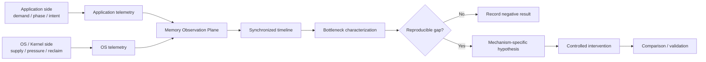
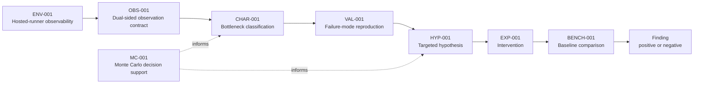

# Finite RAM Lab

A small, reproducible systems research lab for understanding how finite physical RAM aligns with actual application memory demand.

> **Core question:**  
> When physical RAM is limited, what should remain in memory, what should be reclaimed, and when?

[](https://github.com/hopeless-t/finite-ram-lab/actions/workflows/ci.yml)
[](https://github.com/hopeless-t/finite-ram-lab/actions/workflows/env-001.yml)
[](https://github.com/hopeless-t/finite-ram-lab/actions/workflows/env-002.yml)
[](https://github.com/hopeless-t/finite-ram-lab/actions/workflows/obs-001.yml)
[](https://github.com/hopeless-t/finite-ram-lab/actions/workflows/char-001.yml)
[](https://github.com/hopeless-t/finite-ram-lab/actions/workflows/monte-carlo.yml)

## Status

**Systems research / experimental software — multiple active research lanes**

Current principle:

> **Prove state, identity, and evidence authority before optimization.**

Finite RAM Lab began as a broad finite-memory characterization project, then narrowed into a Linux memcg transactional state study. The current repository also carries a second line of work: **Live-State Frontier / decision-space compression**, where the same finite-resource discipline is applied to controller search state.

### Linux memcg transactional lane

The physical memcg work established, among other things:

- a source-grounded 64-page memcg charge batch;
- a resettable direct-Q64 verification phase;
- a verified residual invariant after the one-page primer:
  `R0 = 63, T0 = 64`;
- a broader natural pre-VERIFY bound:
  `0 <= S0 <= 64, T = S0 + 1`;
- source- and trace-grounded named mechanisms including `STARTUP_STOCK_SEED`, `SMALL_RESIDUAL_REFILL`, `TARGET_STOCK_EVICTION`, and `RELEASE_ONLY`;
- an explicit distinction between pre-VERIFY ecology, verified transactional state, instrumentation invalidation, and genuine target contradiction.

Historical `SUCCESS/FAIL` is intentionally no longer treated as a sufficient scientific label.

The passive **B425 Ambient Stock Catcher** remains designed but paused. No new ambient physical session is implied by the newer controller research.

### Live-State Frontier / controller lane

Recent work moved from physical live-state observations into a decision-space model.

Key current results:

- **B445 intrinsic-demand + capacity-clamp model** — for the frozen STRATA-005 dataset,
  `P_peak(H,K) ~= min(B_peak + K, H)` with `B_peak ~= 78.609 MiB`; the pressure/no-pressure classification matched all 8 DONTNEED cells.
- **B446 partial frontier decomposition** — historical data identifies the transient excess over the legacy post-observer floor, but does not falsely split clean persistent state from observer contribution.
- **B451 analysis freeze** — PRIMARY/DESCRIPTIVE objective roles, block-bootstrap semantics, clamp replay, and frontier-loss analysis were made executable before the prospective physical result exists.
- **B452 intervention staircase** — `advice_calls = ceil(span / cadence)` gives an analytic cadence-frontier staircase.
- **B453 corrected cadence quotient** — physical plan IDs may tie exactly; the safe compression target is the set of **distinct Pareto objective vectors**, with tied physical identities retained as provenance.
- **B454 Local Quotient Preservation** — for additive objectives, local dominance pruning plus exact-vector quotienting preserves the distinct global Pareto objective-vector frontier.
- **B455 safety-aware StateOption quotient** — safety qualification happens before quotienting; equal cost is not enough to merge options whose semantic contracts differ.
- **B456 quotient-before-beam benchmark** — in the frozen redundancy panel, mean exact-frontier coverage >=90% required beam width 64 before quotienting and 16 after quotienting; the fixed mixed scenario was neutral, so this is not claimed as a universal monotonic improvement.
- **B457 quotient-aware beam** — raw-input quotient-aware search matches the objective-space result of B455 precompile followed by the older B435 beam under the current additive model.
- **B458 exact quotient Pareto DP — candidate / qualification in progress** — removing beam truncation turns the same prefix search into an exact Pareto dynamic program. The candidate already matched B434 Cartesian exact frontier vectors in the fixed mixed case and in 1,000 randomized StateOption systems; complexity/state-count benchmarking is not yet frozen.

The emerging controller stack is:

```text
semantic / safety proof
        |
        v
unsafe-option elimination
        |
        v
semantic-signature partition
        |
        v
local Pareto prune + exact-vector quotient
        |
        v
lossless prefix Pareto DP
        |
        +--> no truncation -> exact frontier
        |
        +--> beam truncation -> approximate frontier
```

A central research distinction is now:

> **physical plan multiplicity != decision-state multiplicity**

Evidence keeps physical identity; optimization is allowed to operate on a smaller sufficient decision representation only when that quotient is justified.

### Clean Dynamic Frontier prospective study

The next prospective hosted study is fully designed but **not launched**:

- MemoryHigh: 144 / 160 / 176 MiB;
- arms: buffered + DONTNEED 32 / 48 / 64 / 80 / 96 MiB;
- 8 independent runner blocks per capacity;
- 144 total trials;
- paired `post_scan_pre_observer` and `post_scan_post_observer` measurements;
- PRIMARY frontier excludes noisy hosted timing; timing remains DESCRIPTIVE;
- B450 prelaunch software qualification passed 22/22 tests;
- B451 post-run analyzer was frozen before observation.

The experiment is intentionally separated from its launch authority. This README does not imply that the 144-trial workflow has run.

### Open candidate intake

The repository currently has three distinct intake items. They are not equivalent in readiness.

- **Issue #1 — LJP41-01 / LLM-jp-4.1 8B local worker**  
  Experiment contract is useful, but exact 4.1 GGUF artifact identity, size/hash, context limit, and exact compatible llama.cpp/runtime path remain intentionally unbound. No model bytes should be acquired until those are pinned.  
  See [Issue #1](../../issues/1).

- **PR #4 — Mitsuba ternary runtime catfood v0**  
  Draft candidate for PQ2_0/PTQ1_0 runtime/resource topology under a pinned PrismML llama.cpp revision. Repository-side compile/test/CI readback is PASS; an independent minimal review here also passed **5/5 unit tests**. The live weight experiment remains **HOLD** until exact artifact/runtime hashes and sufficient resource headroom are bound.  
  See [PR #4](../../pull/4).

- **PR #5 — Atlas novelty-regime sidecar**  
  Draft candidate implementing only the familiarity/fork gate, not the full Atlas classifier. Independent minimal review passed **6/6 unit tests**. The important unresolved question is incremental value over the existing transactional state machine:
  `familiarity_break_time - first_transaction_pivot_time`. If familiarity does not lead the existing invalidating event, the sidecar adds little value for that regime.  
  See [PR #5](../../pull/5).

### Current evidence boundary

As of this README refresh:

- Clean Dynamic Frontier 144-trial physical run: **NOT RUN**
- B425 ambient canary: **NOT RUN**
- Mitsuba live weight experiment: **HOLD**
- LLM-jp artifact acquisition: **HOLD pending exact identity/runtime binding**
- Atlas sidecar: **software candidate only; predictive lead-time experiment not yet run**
- B458 exact-DP complexity/state-count benchmark: **not yet frozen**

See:

- [Current handoff](handoffs/CURRENT.md)
- [B451 post-run analyzer](docs/B451-CLEAN-DYNAMIC-FRONTIER-POSTRUN-ANALYZER-v0.1.md)
- [B456 quotient-before-beam](docs/B456-QUOTIENT-BEFORE-BEAM-v0.1.md)
- [B457 quotient-aware beam](docs/B457-QUOTIENT-AWARE-BEAM-v0.1.md)

Historical project stages and negative results remain part of the evidence record. The README tracks the current research frontier and deliberately distinguishes **designed**, **software-qualified**, **physically observed**, and **adopted** states.

## Why this project exists

Applications and operating systems observe different parts of the memory problem.

Applications can know the meaning, lifecycle, rebuild cost, phase, and near-future importance of their own data.

The operating system can observe global physical-memory pressure, competition between processes, residency, reclaim activity, faults, refaults, swap behavior, and system-wide resource constraints.

Finite RAM Lab asks whether a measurable gap exists between:

```text
actual application demand
          ↕
OS-estimated demand
          ↕
physical-memory residency
```

and whether closing any observed gap can move the practical memory limit without unacceptable performance loss.

The project does **not** assume that existing Linux memory management is inefficient.

## Research architecture



Observation is intentionally separated from intervention.

## Research order

```text
Observe
  ↓
Characterize
  ↓
Reproduce
  ↓
Form hypothesis
  ↓
Intervene
  ↓
Compare
```

A future mechanism may be an application hint library, a userspace coordination agent, a hybrid design, a minimal kernel extension, or no new mechanism at all.

The implementation is an experimental result, not a premise.

## AI Worker calculation toolbox

The repository includes a spec-driven calculation interface so an AI worker does not need to re-derive standard analysis code for every experiment.

```bash
pip install -e ".[analysis]"
frl doctor
frl catalog
frl template changepoint
frl run-spec path/to/spec.json --out evidence/result.json
```

Ready-made tools currently cover:

- changepoint / knee detection;
- exact offline residency optimization with SciPy/HiGHS MILP;
- conditional information gain;
- small ARX system identification;
- generalized Pareto tail fitting;
- Sobol / Latin-hypercube experiment design;
- PRCC parameter screening.

The same interface can run on GitHub-hosted Actions through `.github/workflows/research-calc.yml`.

See [AI Worker Calculation Toolbox](docs/AI_WORKER_TOOLBOX.md).

## Evidence rules

- observation is not explanation;
- correlation is not causation;
- a refault is not automatically a bad eviction;
- high memory utilization is not automatically inefficient;
- free memory is not itself an optimization objective;
- a successful program execution is not automatically a successful experiment;
- a benchmark improvement is not sufficient evidence of a general memory-management improvement;
- GitHub-hosted measurements describe the declared hosted environment, not arbitrary bare-metal PCs.

Canonical evidence must be structured and carry provenance.

Plots and rendered diagrams are explanatory artifacts unless an experiment contract explicitly says otherwise.

## Research roadmap



Later nodes describe research stages, not predetermined mechanisms.

## Repository structure

The repository is an experiment ledger rather than a single application. The tree below is intentionally selective rather than exhaustive.

```text
finite-ram-lab/
├── README.md
├── pyproject.toml
├── specs/                  # frozen experiment / qualification contracts
├── analysis/               # frozen inputs, replays, and derived evidence
├── handoffs/               # resumable multi-bounce state
├── src/finite_ram_lab/
│   ├── ... memcg / observer / STRATA experiment code ...
│   ├── clean_dynamic_frontier.py
│   ├── clean_dynamic_frontier_study.py
│   ├── clean_dynamic_frontier_analysis.py
│   ├── intrinsic_capacity_clamp.py
│   ├── intervention_staircase.py
│   ├── cadence_frontier_compiler.py
│   ├── option_quotient_compiler.py
│   ├── stateoption_quotient.py
│   ├── quotient_beam_benchmark.py
│   ├── quotient_aware_beam.py
│   └── exact_pareto_dp.py
├── tests/                  # model, invariant, replay, and experiment tests
├── docs/                   # research notes and frozen conclusions
└── .github/workflows/      # hosted experiments; launch authority is separate
```

Candidate intake may live on draft PR branches before adoption. A file existing in a draft PR is not automatically part of the canonical research surface.

The repository grows only when a real experiment, validation need, or evidence-preserving analysis earns a new component.

## Frozen principles

See:

- [Research Charter](docs/RESEARCH_CHARTER.md)
- [Repository Specification](docs/REPOSITORY_SPEC.md)
- [Evidence Model](docs/EVIDENCE_MODEL.md)
- [Execution Model](docs/EXECUTION_MODEL.md)
- [North Star](docs/NORTH_STAR.md)

## Project principle

> **Observe before optimizing.**

And, for future architecture:

> **Do not choose the control plane before measuring the coordination gap.**


## Inspired research

### STRATA-001 — page-cache bypass and semantic HOT-memory preservation

STRATA-001 was inspired by [Niko1221/Strata](https://github.com/Niko1221/Strata), whose explicit VRAM/RAM/SSD tiering and Linux direct-I/O path motivated a narrower Finite RAM Lab question: whether keeping intentionally COLD file data out of page-cache pressure can preserve intentionally HOT anonymous memory under a finite memory budget.

See [the Strata inspiration note](docs/STRATA-INSPIRATION.md) and [STRATA-001 Council](docs/STRATA-001-COUNCIL.md).

The initial study is an independent implementation; no Strata source code is copied into Finite RAM Lab.

### Atlas novelty-regime sidecar — draft intake

[PR #5](../../pull/5) borrows only the source-described familiarity/fork gate as a finite-RAM novelty sidecar. It does not reproduce the Atlas classifier and does not claim that image-task worlds and memory regimes are equivalent.

The useful research question is predictive lead time versus the existing transaction validator, not duplication of the validator itself.

### Mitsuba ternary runtime topology — draft intake

[PR #4](../../pull/4) freezes a reproducible comparison surface for Mitsuba PQ2_0/PTQ1_0 packing/runtime behavior. Live weights remain gated on artifact identity, runtime identity, and resource headroom.

### LLM-jp 4.1 local-worker experiment — issue intake

[Issue #1](../../issues/1) defines a Japanese-first local-worker experiment that explicitly keeps model behavior separate from runtime/template compatibility. Exact 4.1 artifact/runtime identity must be pinned before acquisition or performance testing.

